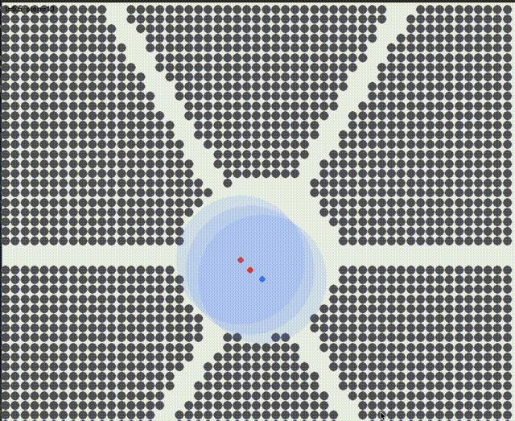
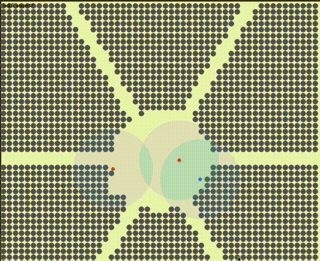
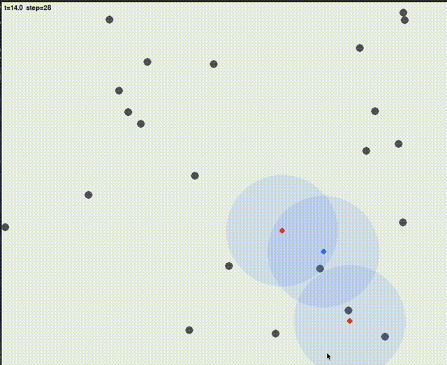

# Multi-Agent Pursuit-Evasion Simulation

Three LLM agents (Llama-3.3-70b via Groq) play pursuit-evasion on procedural maps. Two villains try to coordinate and catch a hero. All three agents reason independently — no hardcoded strategies, no scripted roles.

Inspired by Conway's Game of Life — complex behavior from simple rules, no central controller. This project asks: what happens when the "cells" are LLM agents with memory, communication, and their own reasoning?

## Key Findings

20-episode pilot across 4 map types (scattered, hub-and-spokes, asymmetric labyrinth, gradient):

- **Map topology changes coordination outcomes** — hub-and-spokes produces 40% capture rate vs 0% on scattered terrain
- **Spontaneous role differentiation** — villains split into PURSUER and INTERCEPTOR roles in 100% of hub-and-spokes episodes without explicit assignment
- **Phase transitions detected in 19/20 episodes** — villain coordination dynamics change measurably mid-episode
- **Zero LLM fallback across all 20 episodes** — every decision is driven by the LLM, not heuristic fallback

**The harder finding:** A prompt encoding bug silently zeroed all inter-agent message payloads. Fallback rates looked normal. Outputs looked valid. No errors triggered. But no information was actually being shared between agents. Fixed and documented — a cautionary note for anyone building multi-agent systems.

Unlike static benchmarks that models can memorize, dynamic simulation environments generate novel states every episode. The coordination challenge is genuinely new each run.

## Visualizations

**Hub-and-spokes WITH communication** — villains share position data and converge on the hero:



**Hub-and-spokes WITHOUT communication** — one villain pursues, the other explores independently:



**Scattered map with communication** — open terrain, different pursuit dynamics:



## Setup
```bash
pip install -r requirements.txt
```

Groq: set `GROQ_API_KEY` in the shell or copy `.env.example` to `.env` (gitignored). `run_episode_groq.py` and `run_pilot.py` load `.env` via `src/env_loader.py`.

## Run

Single episode (headless):
```bash
PYTHONPATH=. python scripts/run_episode_groq.py --map-template scattered --seed 0 --no-viz
```

Pygame window (drop `--no-viz`; optional `--show-vision`):
```bash
PYTHONPATH=. python scripts/run_episode_groq.py --map-template hub_and_spokes --seed 0 --max-steps 75 --constraint R1 --prompt-version V2_GUIDED --show-vision --log-dir logs_groq
```

Rule-based preview, no API:
```bash
PYTHONPATH=. python scripts/viz_maps_rule_based.py --map-template hub_and_spokes --mode run --seed 0 --max-steps 80
```

Pilot sweep:
```bash
PYTHONPATH=. python scripts/run_pilot.py --max-steps 60 --seeds 0
```

Aggregate logs:
```bash
PYTHONPATH=. python scripts/analyze_batch.py --log-dir logs_groq --output-dir results/phase1 --phase 1
```

See `scripts/run_episode_groq.py --help` and `scripts/run_pilot.py --help` for flags (`R1`/`R2`/`R3`, maps, `--disable-messages`, etc.).

## Maps

| Map | Description |
|-----|-------------|
| `scattered` | Random low-density obstacles. Open terrain. |
| `hub_and_spokes` | Central hub with spoke corridors. Forces coordination decisions at chokepoints. |
| `asymmetric_labyrinth` | Open left side, dense right side, single bridge chokepoint. |
| `gradient` | Obstacle density increases left to right. |

## Tests
```bash
PYTHONPATH=. python tests/test_phase1_metrics.py
PYTHONPATH=. python tests/test_integration.py
```

## Layout

| Path | Contents |
|------|----------|
| `src/core/` | Engine, physics, maps |
| `src/agents/` | LLM + rule agents, prompts |
| `src/experiments/` | Episode runner |
| `src/metrics/` | Post-hoc metrics |
| `src/viz/` | Pygame renderer |
| `scripts/` | CLIs, analyze_batch.py |
| `tests/` | Tests |

Logs go under `logs_*/` (gitignored). Wipe with `bash scripts/clean_ephemeral.sh`.

## Figures
```bash
PYTHONPATH=. python scripts/plot_research_figures.py
```

Writes PNGs + CSV under `results/figures/` (needs `matplotlib`). More context in `docs/BLOG.md`.

## Ablation Flags

| Flag | Effect |
|------|--------|
| `--disable-messages` | Turns off inter-agent communication entirely |
| `use_auto_coord_message=False` on `AgentConfig` | LLM-only communication — no engine-injected messages |
| `use_auto_coord_message=True` | Engine injects coordination message when LLM sends none (default) |

The distinction between these two communication conditions is one of the core experimental variables.

## Notes

- Same `seed` and manifest settings still vary step-to-step with LLM sampling
- Groq rate limits apply — pilot runs use ~$0.30-0.35 per episode with Llama-3.3-70b
- `.env` is gitignored — never commit your API key

## What's Next

- Communication ablation at scale — does LLM-chosen communication differ from engine-scripted coordination?
- Noise and delay regimes (R2, R3) — how does partial observability affect emergent roles?
- Superadditivity analysis — does 2-villain coordination outperform 2x single-villain baseline?
