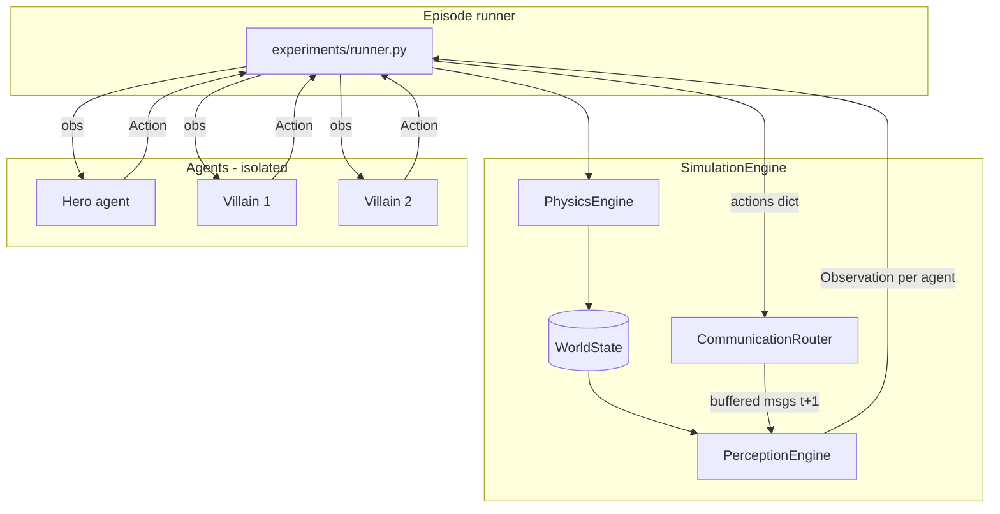
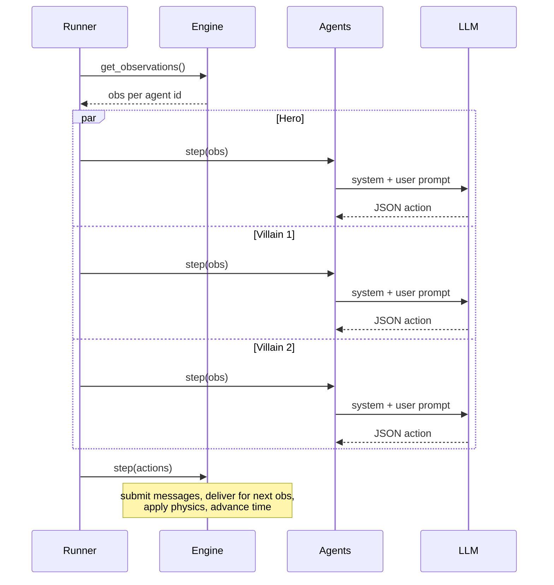
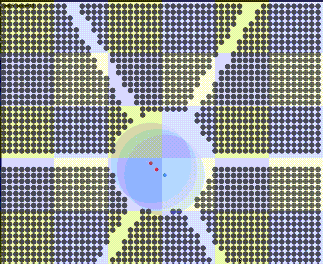
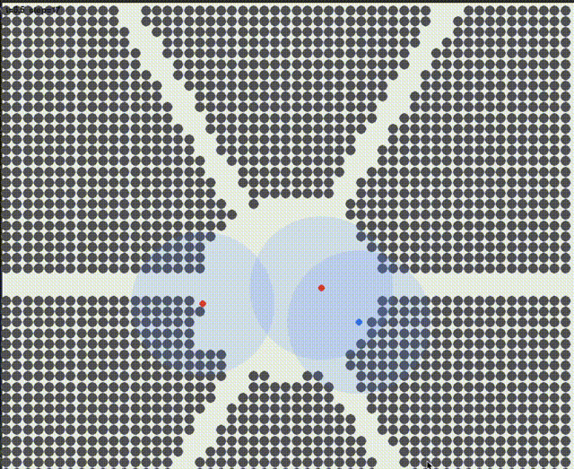
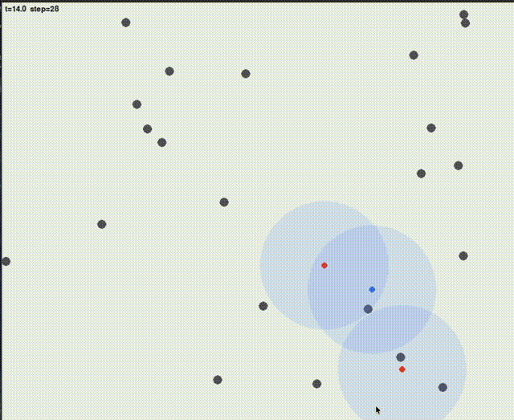

# Multi-Agent Pursuit-Evasion Simulation

A 2D pursuit-evasion environment where a hero and two villains each take a turn every step. Policies can be LLM-backed (Groq / OpenRouter / Gemini / Ollama), rule-based, or greedy baselines. The engine owns the world; agents never mutate shared state.

Default LLM setup: Llama-3.3-70B via Groq, JSON actions validated per step, private per-agent session history.

## Architecture


```mermaid
flowchart TB
  subgraph runner [Episode runner]
    R[experiments/runner.py]
  end

  subgraph engine [SimulationEngine]
    P[PerceptionEngine]
    C[CommunicationRouter]
    X[PhysicsEngine]
    W[(WorldState)]
  end

  subgraph agents [Agents - isolated]
    H[Hero agent]
    V1[Villain 1]
    V2[Villain 2]
  end

  W --> P
  P -->|Observation per agent| R
  R -->|obs| H
  R -->|obs| V1
  R -->|obs| V2
  H -->|Action| R
  V1 -->|Action| R
  V2 -->|Action| R
  R -->|actions dict| C
  C -->|buffered msgs t+1| P
  R --> X
  X --> W
```

**Ownership rule:** only `SimulationEngine` updates `WorldState`. The runner gets observations, calls `agent.step(obs)` in parallel, then passes the action dict into `engine.step(actions)`.

### One decision step


```mermaid
sequenceDiagram
  participant Runner
  participant Engine
  participant Agents
  participant LLM

  Runner->>Engine: get_observations()
  Engine-->>Runner: obs per agent id
  par Hero
    Runner->>Agents: step(obs)
    Agents->>LLM: system + user prompt
    LLM-->>Agents: JSON action
  and Villain 1
    Runner->>Agents: step(obs)
    Agents->>LLM: system + user prompt
    LLM-->>Agents: JSON action
  and Villain 2
    Runner->>Agents: step(obs)
    Agents->>LLM: system + user prompt
    LLM-->>Agents: JSON action
  end
  Runner->>Engine: step(actions)
  Note over Engine: submit messages, deliver for next obs,<br/>apply physics, advance time
```

### LLM agent path

```
Observation + AgentSession
        |
        v
  prompts.py  ->  system + user JSON
        |
        v
  LLM client / BAML ChooseAgentAction
        |
        v
  schema.py  ->  LLMActionOutput  ->  Action
        |
        v
  movement post-process (hero blend / villain target geometry)
        |
        v
  session.record_turn(...)  then return Action
```

Each agent keeps its own `AgentSession` (prompt history, last valid action, memory summary). Sessions are never shared across agents.

### Repo layout

| Path | Role |
|------|------|
| `src/core/` | Engine, physics, perception, maps, models |
| `src/agents/` | LLM / rule / greedy / self-steer agents, prompts, schema, sessions, clients |
| `src/experiments/` | Episode runner, logging |
| `src/metrics/` | Post-hoc capture, coordination, roles, phase, stuck, etc. |
| `src/viz/` | Pygame renderer |
| `scripts/` | CLIs for episodes, pilots, analysis, map validation |
| `viewer/` | Next.js 3D replay of exported episode JSON |
| `baml_src/` | BAML action schema (typed LLM output) |
| `tests/` | Integration + metric tests |

## Maps

Procedural templates (seeded):

| Template | What it forces |
|----------|----------------|
| `scattered` | Low-density random obstacles; open pursuit |
| `hub_and_spokes` | Central hub + spoke corridors; LOS breaks at spoke entrances |
| `asymmetric_labyrinth` | Open left, dense right, single bridge chokepoint |
| `gradient` | Obstacle density rises left to right |
| `open` / `chokepoint` / `standard_maze` | Additional control / bottleneck / maze variants |

Obstacle generation and spawn rules live in `src/core/engine.py`. Observations carry `map_template`, `world_obstacles`, and optional `chokepoint_positions` into the prompt.

## What we measured

20-episode pilot (4 maps x 5 seeds, V2 guided prompts, R1, 150-step cap): **16 escapes, 4 captures** (~20% capture).

| Map | Escaped | Captured |
|-----|---------|----------|
| scattered | 4 | 1 |
| hub_and_spokes | 3 | 2 |
| asymmetric_labyrinth | 4 | 1 |
| gradient | 5 | 0 |

Takeaways from that batch and paired ablations:

- **Topology matters.** Hub-and-spokes was hardest for the hero in this sweep; gradient was easiest.
- **Comms change visible behavior.** On hub-and-spokes with messaging on, villains tend to align and push together. With `--disable-messages`, one often pursues while the other explores.
- **Roles can emerge without assignment.** Villains sometimes split into pursuer / interceptor patterns on structured maps (see role metrics under `src/metrics/`).
- **Logs can lie about information flow.** A prompt encoding bug once zeroed inter-agent message payloads. Fallback rates looked fine, JSON validated, no exceptions. Agents were not actually sharing coordinates. Fixed and logged as a process lesson: validate the *content* of the communication channel, not only that a message object exists.

Same seed + manifest still varies step-to-step because of LLM sampling. Treat single-episode GIFs as illustration, not proof.

## Visualizations

Hub-and-spokes **with** communication:



Hub-and-spokes **without** communication:



Scattered with communication:



More writeup: [`docs/BLOG.md`](docs/BLOG.md). 3D replay viewer: [`viewer/README.md`](viewer/README.md).

## Setup

```bash
pip install -r requirements.txt
cp .env.example .env   # set GROQ_API_KEY
```

`scripts/run_episode_groq.py` and `scripts/run_pilot.py` load `.env` via `src/env_loader.py`. Shell exports still win if already set.

Optional: regenerate BAML client after editing `baml_src/` (`baml-cli generate` / project `baml.toml`).

## Run

Single episode (headless):

```bash
PYTHONPATH=. python scripts/run_episode_groq.py --map-template scattered --seed 0 --no-viz
```

Pygame window:

```bash
PYTHONPATH=. python scripts/run_episode_groq.py \
  --map-template hub_and_spokes --seed 0 --max-steps 75 \
  --constraint R1 --prompt-version V2_GUIDED --show-vision \
  --log-dir logs_groq
```

Rule-based preview (no API):

```bash
PYTHONPATH=. python scripts/viz_maps_rule_based.py \
  --map-template hub_and_spokes --mode run --seed 0 --max-steps 80
```

Pilot sweep and aggregate:

```bash
PYTHONPATH=. python scripts/run_pilot.py --max-steps 60 --seeds 0
PYTHONPATH=. python scripts/analyze_batch.py --log-dir logs_groq --output-dir results/phase1 --phase 1
PYTHONPATH=. python scripts/plot_research_figures.py
```

Export for the 3D viewer:

```bash
PYTHONPATH=. python scripts/export_episode_for_viewer.py \
  --log-dir logs_groq --episode-id <id>
cd viewer && npm install && npm run dev
```

Flags: see `scripts/run_episode_groq.py --help` (`R1`/`R2`/`R3`, maps, `--disable-messages`, etc.).

## Ablation knobs

| Knob | Effect |
|------|--------|
| `--disable-messages` | No inter-agent messaging |
| `AgentConfig.use_auto_coord_message=False` | LLM must emit messages itself; engine does not inject coord payloads |
| `AgentConfig.use_auto_coord_message=True` | If the LLM sends no message, engine can inject a compact coord payload (default) |
| Prompt version / constraint regime | Changes guidance text and sight / noise / delay settings |

The gap between engine-injected coords and LLM-chosen messages is an intentional experimental axis.

## Tests

```bash
PYTHONPATH=. python tests/test_phase1_metrics.py
PYTHONPATH=. python tests/test_integration.py
```

## Limits

- Hero movement is not pure LLM output: blending, boundary push, and stuck recovery can override directions.
- Physics can halt or perturb blocked moves; inspect `movement_debug` / `movement_source` in logs.
- Phase / beacon / superadditivity metrics are helpers for analysis, not automatic claims.
- Groq rate limits apply; ballpark ~$0.30-0.35 per episode with Llama-3.3-70B at pilot settings.
- `.env` is gitignored. Do not commit API keys.

Logs land under `logs_*/` (gitignored). Wipe with `bash scripts/clean_ephemeral.sh` if present.
